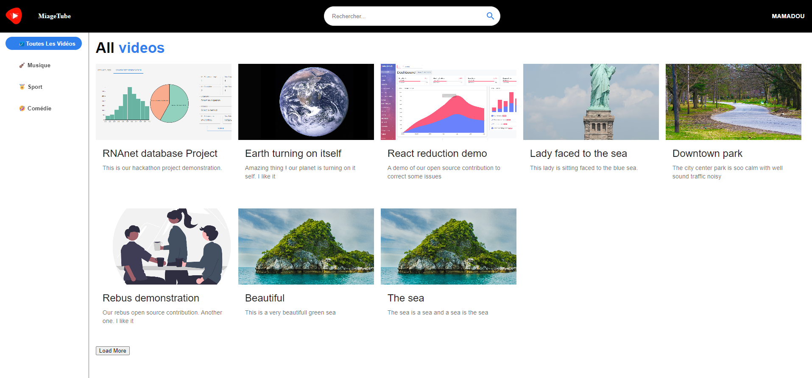
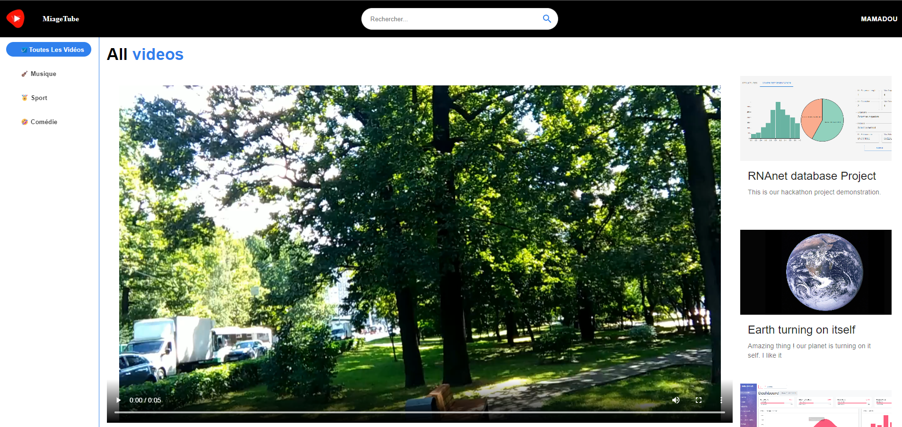
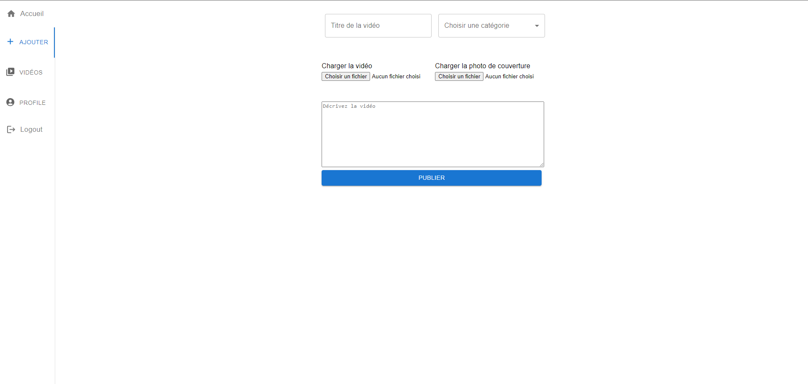
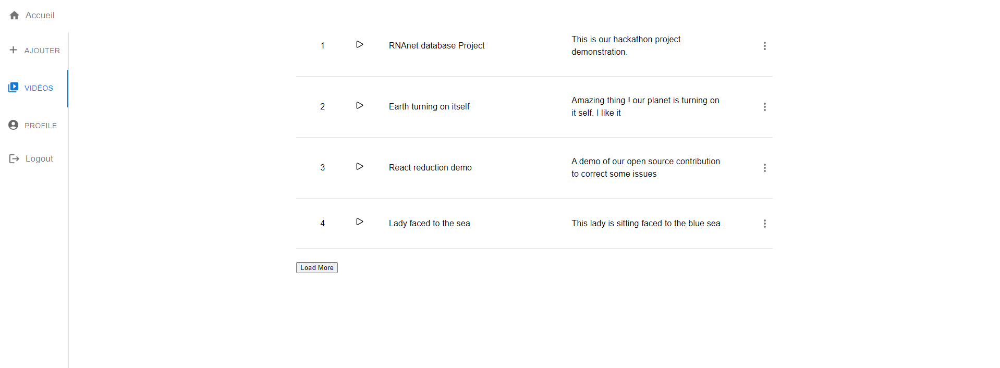
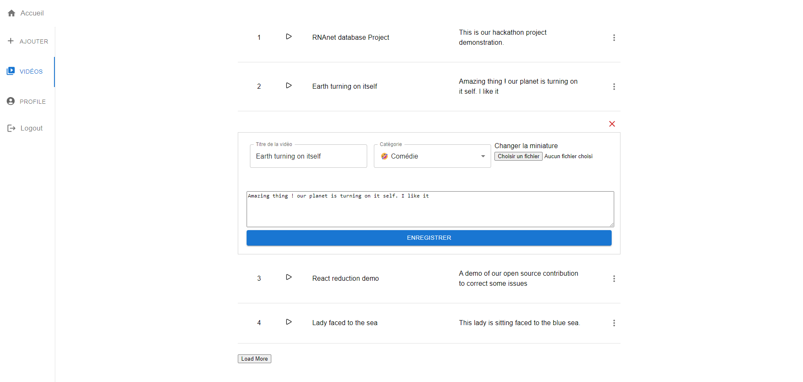

# How to use the project

## Getting started

### **Clone the project**:

git clone [https://github.com/Kodians/video-player-client.git](https://github.com/Kodians/video-player-client.git)

### **Add environment variables**

- Create at the root of your project the file `.env.local`
- Add the variable `NEXT_PUBLIC_API_URL` which value is the URL of the server

  For example if the server is accessible by the URL: **http://localhost:3000**
  then the `.env.local` file will contain `NEXT_PUBLIC_API_URL=http://localhost:3000`

### **Set up the project**:

Install dependencies: `yarn install`

To start the development server run the command: `yarn run dev`

### **Live Demo**

Clone the project service server from [https://github.com/Kodians/video-streaming-service](https://github.com/Kodians/video-streaming-service) and run it on the port **3000**

Then you can find the project deployed on github pages [here](https://kodians.github.io/video-player-client/).

### **Some Screenshots**

#### Public videos

#### Public videos

### User video uploading form on its personal space

### User videos pages on its personal space

### Editing a video metadata from user personal space

<!-- markdownlint-restore -->
<!-- prettier-ignore-end -->

<!-- ALL-CONTRIBUTORS-LIST:END -->
<!-- prettier-ignore-start -->
<!-- markdownlint-disable -->

<!-- markdownlint-restore -->
<!-- prettier-ignore-end -->

<!-- ALL-CONTRIBUTORS-LIST:END -->
